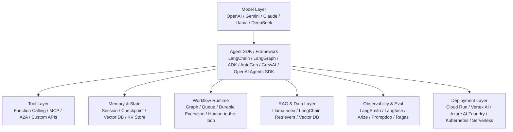
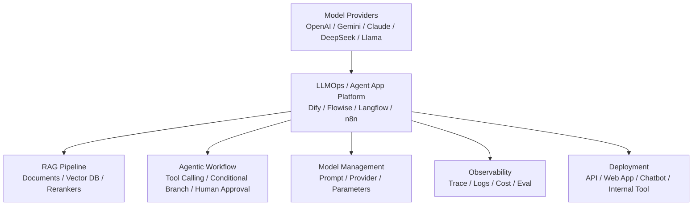
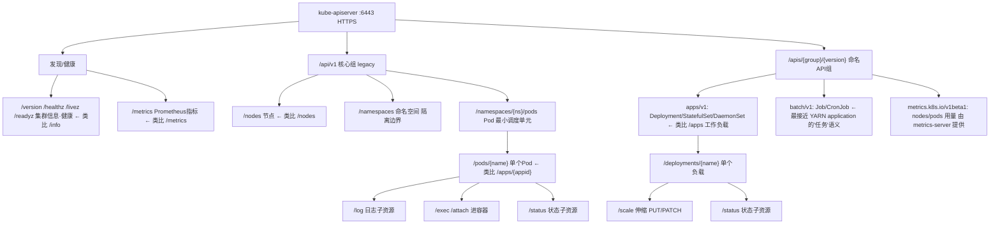

```mermaid
flowchart TD
    A[Model Layer<br/>OpenAI / Gemini / Claude / Llama / DeepSeek] --> B[Agent SDK / Framework<br/>LangChain / LangGraph / ADK / AutoGen / CrewAI / OpenAI Agents SDK]
    B --> C[Tool Layer<br/>Function Calling / MCP / A2A / Custom APIs]
    B --> D[Memory & State<br/>Session / Checkpoint / Vector DB / KV Store]
    B --> E[Workflow Runtime<br/>Graph / Queue / Durable Execution / Human-in-the-loop]
    B --> F[RAG & Data Layer<br/>LlamaIndex / LangChain Retrievers / Vector DB]
    B --> G[Observability & Eval<br/>LangSmith / Langfuse / Arize / Promptfoo / Ragas]
    B --> H[Deployment Layer<br/>Cloud Run / Vertex AI / Azure AI Foundry / Kubernetes / Serverless]
```

```mermaid
flowchart TD
    A[Model Providers<br/>OpenAI / Gemini / Claude / DeepSeek / Llama] --> B[LLMOps / Agent App Platform<br/>Dify / Flowise / Langflow / n8n]
    B --> C[RAG Pipeline<br/>Documents / Vector DB / Rerankers]
    B --> D[Agentic Workflow<br/>Tool Calling / Conditional Branch / Human Approval]
    B --> E[Model Management<br/>Prompt / Provider / Parameters]
    B --> F[Observability<br/>Trace / Logs / Cost / Eval]
    B --> G[Deployment<br/>API / Web App / Chatbot / Internal Tool]
```

```mermaid
graph TD
    A["kube-apiserver :6443 HTTPS"] --> Disc["发现/健康"]
    A --> Core["/api/v1 核心组 legacy"]
    A --> Grp["/apis/{group}/{version} 命名API组"]

    Disc --> D1["/version /healthz /livez /readyz 集群信息·健康 ← 类比 /info"]
    Disc --> D2["/metrics Prometheus指标 ← 类比 /metrics"]

    Core --> C1["/nodes 节点 ← 类比 /nodes"]
    Core --> C2["/namespaces 命名空间 隔离边界"]
    Core --> C3["/namespaces/{ns}/pods Pod 最小调度单元"]
    C3 --> P1["/pods/{name} 单个Pod ← 类比 /apps/{appid}"]
    P1 --> P2["/log 日志子资源"]
    P1 --> P3["/exec /attach 进容器"]
    P1 --> P4["/status 状态子资源"]

    Grp --> G1["apps/v1: Deployment/StatefulSet/DaemonSet ← 类比 /apps 工作负载"]
    G1 --> G1a["/deployments/{name} 单个负载"]
    G1a --> G1b["/scale 伸缩 PUT/PATCH"]
    G1a --> G1c["/status 状态子资源"]
    Grp --> G2["batch/v1: Job/CronJob ← 最接近 YARN application 的'任务'语义"]
    Grp --> G3["metrics.k8s.io/v1beta1: nodes/pods 用量 由 metrics-server 提供"]
```