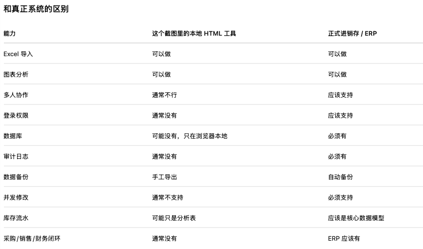

从截图本身看，这不像某个成熟开源进销存/ERP 产品的标准 UI，更像是一个定制的本地 HTML 单页工具 / prototype。

关键证据在左上角：

出入库管理与供应商价格分析
本地 HTML 工具 V1

这几个字基本说明它不是 ERPNext、Odoo、Dolibarr、管家婆、金蝶这类现成产品，而是有人专门为这个需求做的一个 local HTML tool。它可能是：

可能来源	判断
自己写的 HTML + JS 工具	很可能
ChatGPT / Claude / v0 / Cursor 生成的前端 demo	很可能
某个开源 ERP 的界面	不像
SaaS 产品截图	不像
ERPNext / Odoo / Dolibarr	基本不像

UI 风格上像是：

* 左侧 sidebar；
* 顶部 action buttons；
* card-style dashboard；
* chart panel；
* Excel import/export；
* 本地数据分析。

这更接近一个 静态前端 dashboard，可能用这些技术做的：

层	可能技术
前端	HTML / Tailwind CSS / Vue / React
图表	ECharts / Chart.js
Excel 解析	SheetJS / xlsx
本地存储	localStorage / IndexedDB
报表导出	xlsx / FileSaver.js

而且它写着 “本地 HTML 工具 V1”，说明它大概率是：

打开一个 .html 文件，导入 Excel，在浏览器里解析和展示数据，不一定有后端、数据库、登录、权限、多人协作。

这类工具可以做 demo，但不等于正式进销存系统。

我的判断

这个 UI 不是你要找的“开源产品”，而是一个围绕你朋友需求做出来的定制前端 demo / 本地分析工具。

它适合用来：

1. 验证字段设计；
2. 验证老板/业务方想看的报表；
3. 清洗历史 Excel；
4. 做需求原型。

但不适合作为长期正式系统，除非继续补上：

* 后端 API；
* 数据库；
* 用户登录；
* 权限管理；
* 审计日志；
* 自动备份；
* 数据导入校验；
* 多人并发处理；
* 库存流水模型；
* 部署和运维方案。

如果你朋友现在只是想“先把多年 Excel 管起来并做分析”，这个工具可以继续打磨；如果他们想做正式进销存，建议把它当作 prototype，再决定是迁移到 ERPNext/Odoo，还是基于这个原型重新做一个 web app。